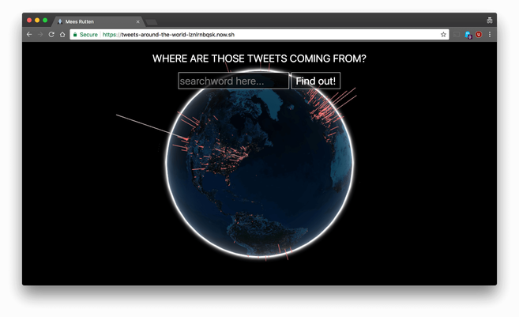

# Tweets around the world

## About this project
This project shows the user a globe.
The user can search for a certain word on Twitter.
The location of these tweets will be gathered and displayed on the globe.
This way a user can see where in the world people talk about certain subjects the most.


<p>The globe with locations</p>

- **[Install and run](#install-and-run)**  
- **[Tooling](#tooling)**  
- **[Data model](#data-model)**  
- **[Database](#database)**  
- **[Events](#events)**  
- **[Twitter stream API](#twitter-stream-api)**  
- **[Data manipulation and how it works](#data-manipulation-and-how-it-works)**  
- **[Offline notice](#offline-notice)**  
- **[Dummy data](#dummy-data)**  
- **[Wishlist](#wishlist)**  

## Install and run
Install
```bash
npm install
```

Run
```bash
npm run dev
```

## Tooling
- Socket.io
> `Socket.io` is a library I used to send data between the client and the server. `Socket.io` makes it possible to group clients in rooms and receive data from the server.
- Google DataArts WebGL Globe, The WebGL Globe is an open platform for geographic data visualization created by the Google Data Arts Team.
> [GitHub repository](https://github.com/dataarts/webgl-globe)
- `Google Geocoder API` to find the latitude and longitude of tweets
> [API page](https://developers.google.com/maps/documentation/geocoding/intro)
- `Three.js` for the globe and globe animations
- `Tween.js` for animation of the globe
- `underscores` for useful premade functions

## Data model

<p>Tweets around the world, datamodel</p>
For more info check [Data manipulation and how it works](#data-manipulation-and-how-it-works)

## Database
I have not used a database because I want to show realtime tweets. Using a database could be unneccessary.

## Events
`searchVal` is a client-sent emit which contains the searchword a user wants the see on the globe. \
`locationUpdate` is a server-sent emit which sends an array of latitude, longitude and magnitude of tweet locations
`disconnect` when the user disconnects an overlay will the shown to indicate the connection status of the user
`reconnect` when the user reconnects the overlay will disappear and the user will receive locations again.

## Twitter stream API
[Twitter Realtime filter API](https://developer.twitter.com/en/docs/tweets/filter-realtime/overview)
>Returns public statuses that match one or more filter predicates. Multiple parameters may be specified which allows most clients to use a single connection to the Streaming API. Both GET and POST requests are supported, but GET requests with too many parameters may cause the request to be rejected for excessive URL length. Use a POST request to avoid long URLs.
Twitter Dev Team

This API makes it possible to search for certain tweets by queries.
The query I used for this project is the searchword the user wants to see on the globe.

## Data manipulation and how it works
When a user sends a certain keyword to the server, the server uses this searchword to start the Twitter stream.
The Twitter stream will get all the tweets from the moment the user sent the searchword.
When the server gets the tweets it will check for the location of the tweet or the locations of the tweet sender.
If there is a location to the tweet or sender, the server will send this location to the Geocoder API and this API should get the latitude and longitude of the location.
Once the latitude and longitude are found, I will check if this location is already present in my locations array.
If the location is already present I add to the magnitude which will result in a bigger line on the globe.
If the location is not yet present I will just add it to the array with a magnitude of 0.01.
This array will be sent to the user every 10 times a tweet location is added to the array.

## Offline notice
If a user gets disconnected a screen overlay will appear that the user is offline.
The screen has a small opacity and the globe stays interactive.
Once the user reconnects the screen overlay disappears and the user will receive realtime tweets again.

## Dummy data
Because the Google Geocoder API has a limit of 2500 calls per day I created a function that injects dummy data.

## Wishlist
I want to reduce the size of the sent array via `socket.io`.
For each 5-10 new tweets I want to send a new array to the client.
On clientside this new data will be added to the array in which the globe data sits.
There should also be a function, that fires when the location array becomes too big to process, that unshifts the location data on it's limit

I want to create the possibility to do multiple searchwords and see where a certain searchword was tweeted and what that word was.
